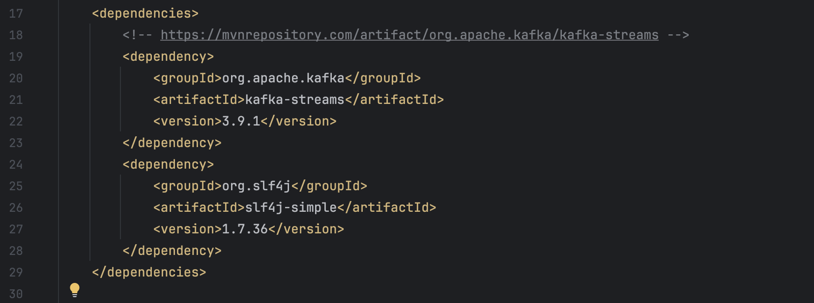
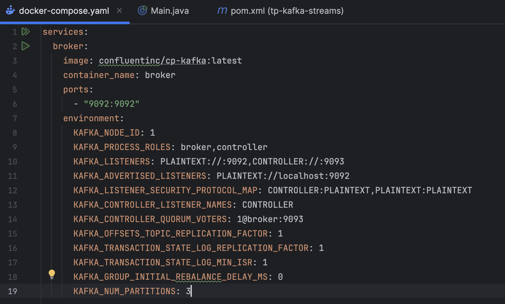
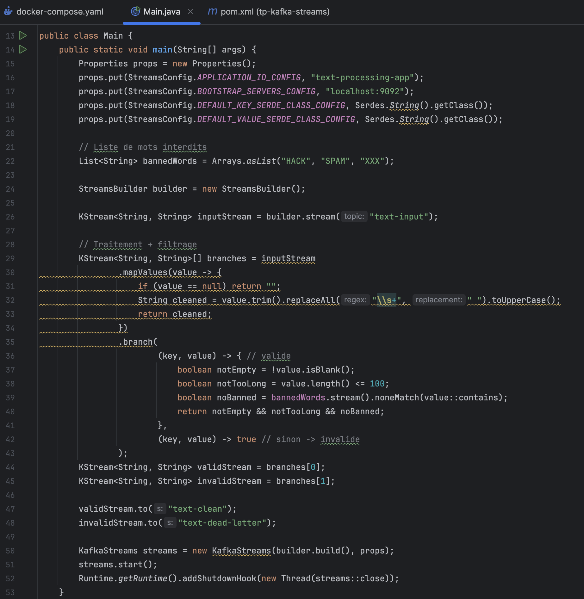
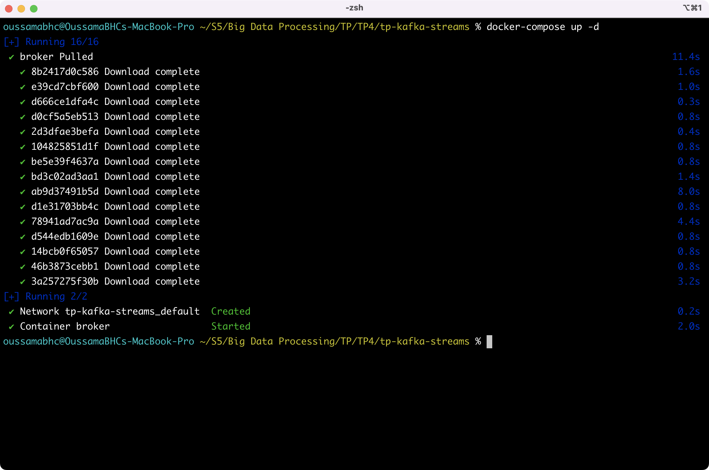
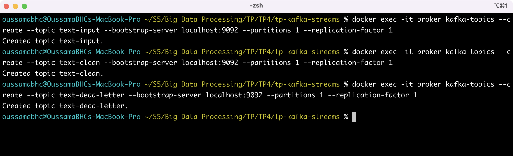
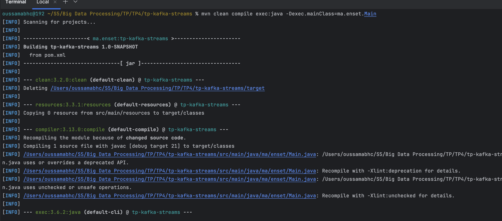
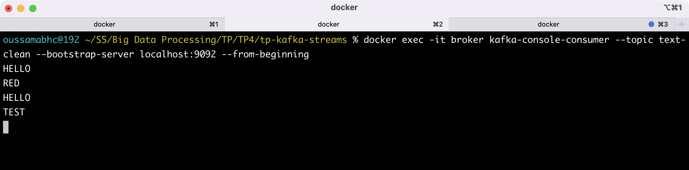
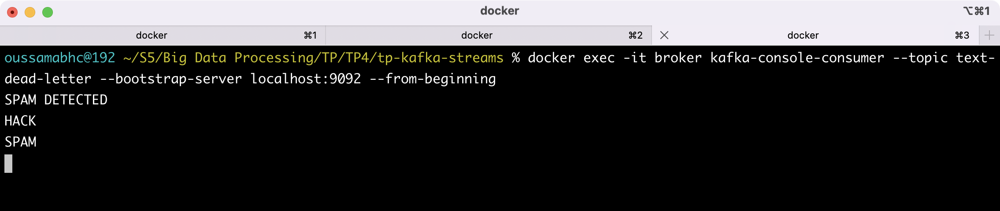

# Kafka Streams - TP : Traitement de texte avec filtrage et routage

Ce projet implémente une **application Kafka Streams** en Java qui traite des messages texte bruts, les nettoie, les valide selon des règles métier, puis les route vers deux topics distincts :
- `text-clean` : messages valides et nettoyés
- `text-dead-letter` : messages invalides (rejetés tels quels)

---

## Fonctionnalités implémentées

1. **Création des topics Kafka** :
   - `text-input` → topic d'entrée
   - `text-clean` → messages valides nettoyés
   - `text-dead-letter` → messages rejetés

2. **Nettoyage des messages** :
   - `trim()` : suppression des espaces en début/fin
   - Remplacement des espaces multiples par un seul
   - Conversion en **majuscules**

3. **Filtrage strict** :
   - Message vide ou uniquement des espaces → rejet
   - Contient un mot interdit (`HACK`, `SPAM`, `XXX`) → rejet
   - Longueur > 100 caractères → rejet

4. **Routage conditionnel** :
   - Valide → `text-clean`
   - Invalide → `text-dead-letter`

5. **Tests avec Kafka Console Producer/Consumer** via Docker

---

## Technologies utilisées

- **Java 17+**
- **Kafka Streams 3.9.1**
- **SLF4J 1.7.36** (logging)
- **Confluent Kafka Docker Image** (`cp-kafka:latest`)
- **Maven** pour la gestion des dépendances
- **Docker Compose** pour lancer le broker Kafka

---

## Structure du projet
```text
tp-kafka-streams/
├── src/main/java/ma/enset/Main.java
├── pom.xml
├── docker-compose.yml
├── images/
│   ├── pom-xml.png
│   ├── docker-compose.png
│   ├── main-java-code.png
│   ├── docker-up.png
│   ├── topic-creation.png
│   ├── maven-build.png
│   ├── producer-input.png
│   ├── consumer-clean.png
│   └── consumer-dead-letter.png
└── README.md
```

---

## Configuration Maven (`pom.xml`)



---

## Configuration Docker (`docker-compose.yml`)



---

## Code Java principal (`Main.java`)



---

## Démarrage du broker Kafka



---

## Création des topics Kafka



---

## Compilation et exécution de l'application



---

## Tests avec Producer/Consumer

### Envoi de messages dans `text-input`


### Consommation de `text-clean` (messages valides)



### Consommation de `text-dead-letter` (messages invalides)



---

## Résumé des tests

| Message d’entrée | Nettoyé | Valide ? | Topic de sortie |
|-----------------|---------|----------|----------------|
| hello           | HELLO   | Oui      | text-clean     |
| test            | TEST    | Oui      | text-clean     |
| spam            | SPAM    | Non      | text-dead-letter |
| HACK            | HACK    | Non      | text-dead-letter |